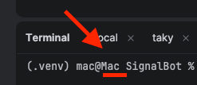

# Setup and usage

How to stand the whole path up from nothing, what the bot accepts, and what it puts on the
wire. For why this stack and what it does not do, see [APPROACH.md](APPROACH.md).

Substitute your own values for the placeholders used throughout:

| Placeholder | Value |
| --- | --- |
| `{your_number}` | Bot's Signal number, E.164 format, e.g. `+441632960001` |
| `{group_id}` | Signal group ID, `group.` prefix included |
| `{your_lan_ip}` | Your machine's LAN address, e.g. `192.168.1.42` |
| `{hostname}` | Your machine's name |

---

## 0. Prerequisites

Docker, an iPhone with iTAK, and Python 3.11 or newer. One venv holds both the bot and
the taky server:

```bash
python3.14 -m venv .venv && source .venv/bin/activate
pip install -r requirements.txt
pip install taky
```

`requirements.txt` is the single source of truth — no poetry, no lock file, no packaging
step. `pytest.ini` holds nothing but `asyncio_mode`, which the async test suite needs. taky
is a separate install because it is a server, not a bot dependency, but its `setuptools`
requirement sits in `requirements.txt`: taky 0.10 imports `pkg_resources`, which venvs
stopped bundling in Python 3.12, so `taky` and `takyctl` fail at import without it. On 3.13+
taky also prints a `pkg_resources is deprecated` warning at every start — harmless.

Built and verified on macOS 26.5.1, Python 3.14.3, taky 0.10. Finding
the LAN IP, the firewall settings and AirDrop below are macOS-specific; everything else
is platform-agnostic.

## 1. Start signal-cli-rest-api

```bash
cp -n .env.example .env
docker compose pull
SIGNAL_MODE=normal docker compose up -d      # link in `normal` mode
```

Confirm it is up: <http://127.0.0.1:8080/v1/about>.

If port 8080 is already taken by an older, hand-started container, remove it first:
`docker rm -f signal-api`.

## 2. Link your phone

1. Open <http://127.0.0.1:8080/v1/qrcodelink?device_name=cot-bot>.
2. Signal app → **Settings → Linked devices → +** → scan the QR code.

Credentials are written to `./signal-cli-config` (gitignored). Then switch to the mode the
bot needs:

```bash
docker compose up -d --force-recreate          # MODE=json-rpc by default
docker compose logs signal-api | grep -i jsonrpc  # "…added it to jsonrpc2.yml"
```

## 3. Create the group and read its ID

The bot only reads one group, and it will not create it for you. In the Signal app,
create a new group — the name is irrelevant, and a group containing nobody but yourself is
enough to test with, since the linked account *is* your account. Then read its ID:

```bash
curl -s http://127.0.0.1:8080/v1/groups/{your_number} | python3 -m json.tool
```

```json
[
  {
    "id": "{group_id}",
    "members": ["{your_number}"]
  }
]
```

Copy `id` — including the `group.` prefix — into `.env`:

```ini
SIGNAL_SERVICE="127.0.0.1:8080"
PHONE_NUMBER="{your_number}"
GROUP_ID="{group_id}"
```

Create the group **before** starting the bot. Handlers are bound to groups once, at startup;
a group created later is not picked up until you restart. Messages to any other group are
ignored.

## 4. Set up the taky server

**Find your LAN IP.** The certificates are issued for this address, so it must be the one
the iPhone can reach:

```bash
ipconfig getifaddr $(route -n get default | awk '/interface:/{print $2}')
# → use this as {your_lan_ip} below and as a TAK_HOST in .env
```

**Generate the server and certificates.** Skip this if `taky-server/` already exists:
regenerating the CA invalidates every client package already imported on a phone.

`{hostname}` is the name of the machine running the server — in this example, `Mac`:



```bash
takyctl setup --host {hostname} --public-ip {your_lan_ip} ./taky-server
cd taky-server
takyctl build_client --is_itak itak_client     # → itak_client.zip, for the iPhone
```

This writes the CA and server keypair into `taky-server/ssl/`. The bot reuses
`server.crt` / `server.key` as its client certificate — both are signed by the same CA, so
taky accepts them (`client_cert_required = True`).

**Open the LAN path.** Port 8089 must be reachable from the phone. For a local test,
System Settings → Network → Firewall → off, or allow inbound connections for `python`.
Or you can do it via terminal:

```bash
sudo /usr/libexec/ApplicationFirewall/socketfilterfw --setglobalstate off
```

**Start the server** (SSL listener on 8089):

```bash
taky -l debug -c ./taky.conf
```

taky runs in the foreground from inside `taky-server/` and holds that terminal. Steps 5 and
6 run in new terminals, from the project root.

## 5. Import the client package on the iPhone

`itak_client.zip` just needs to reach the phone. AirDrop is the shortest route — right-click
`taky-server/itak_client.zip` in Finder → **Share → AirDrop** → pick your iPhone.

Over the network instead, from a second terminal:

```bash
cd taky-server && python3 -m http.server 8000
```

then on the iPhone (same Wi-Fi) open `http://{your_lan_ip}:8000/itak_client.zip` in Safari.

Either way:

1. The zip lands in Files or Downloads.
2. Import it from iTAK's network settings.
   The package carries the client `.p12`, the server `.p12` and `preference.pref`, so the
   server entry is created for you.
3. iTAK shows `{your_lan_ip}:8089` as connected. The phone must be on the same Wi-Fi —
   AirDrop moves the file, but the CoT link itself is over the LAN.

## 6. Run the bot

Add the taky endpoint to `.env`:

```ini
TAK_HOST="{your_lan_ip}"
TAK_PORT="8089"
```

```bash
python bot.py
```

Expected log lines:

```
[INFO] - refresh  - [Bot] 1 groups detected
[INFO] - _produce - [Bot] Producer #1 started
[INFO] - _consume - [Bot] Consumer #1 started
```

`groups detected` counts every group the linked account belongs to — it is not a check on
`GROUP_ID`. What confirms `GROUP_ID` is the *absence* of a `is not a valid group name or id`
warning.

Send `ping` to the group; the bot replies `pong`. That is the cheap liveness check — the CoT
path is covered under [Verification](#verification).

---

## Message format

Trigger regex (`commands/atak.py`): `^\s*(-?\d+(?:\.\d+)?)\s+(-?\d+(?:\.\d+)?)\s+(\S+)\s*$`

```
<latitude> <longitude> <label>
```

The label must be a single token, no spaces. Anything else is ignored, so ordinary chat in
the group does not produce markers.

### Target types

The label does two jobs: it is the callsign drawn on the map, and it picks the CoT type, so
a `tank` and a `truck` get different symbols rather than one generic box. Mapping lives in
`COT_TYPES` (`utils/cot_utils.py`); codes are MIL-STD-2525 branches from the CoT type list
with the affiliation slot set to `h`, hostile.

| Label | CoT type | Symbol |
| --- | --- | --- |
| `tank` | `a-h-G-E-V-A-T` | Gnd/Equip/Vehic/Armor/Tank |
| `truck` | `a-h-G-E-V-U-X` | Gnd/Equip/Vehic/Cross Country Truck |
| `bus` | `a-h-G-E-V-U-B` | Gnd/Equip/Vehic/Bus |
| `vehicle`, `car` | `a-h-G-E-V-U` | Gnd/Equip/Vehic/Utility |
| `infantry`, `troops` | `a-h-G-U-C-I` | Gnd/Combat/Infantry/Troops (Open) |
| anything else | `a-h-G` | hostile ground, unspecified |

An unrecognised label falls back to `a-h-G` on purpose: the report establishes something
hostile on the ground at that point and nothing more, and guessing a symbol from an unknown
word would put a claim on the map the operator never made. Extend the table to add types.

**Coordinate order.** Read as longitude-then-latitude, the sample `48.567123 39.87897`
lands in the Caspian Sea. Read latitude-first it is eastern Ukraine, the intended target
area — so the bot parses latitude first.

**Coordinate range.** The trigger regex only checks shape, so `999.9 999.9 tank` and
`91 181 tank` match it. Latitude is range-checked against ±90 and longitude against ±180
before anything is transmitted; a report outside those bounds gets a reply naming the
offending value and never reaches the TAK server.

```
> 91 181 tank
Could not add tank to the map — latitude 91 is outside ±90. Expected: <latitude ±90>
<longitude ±180> <label>, e.g. 48.567123 39.87897 tank
```

## CoT protocol

CoT is an XML event schema over a TCP stream. Each event is one `<event>` document
terminated by a null byte (`\x00`) — that delimiter is how the TAK server finds message
boundaries on the stream.

```xml
<event version="2.0"
       uid="tank-48.567123-39.87897"
       type="a-h-G-E-V-A-T"
       how="h-e"
       time="2026-09-01T09:14:22.481Z"
       start="2026-09-01T09:14:22.481Z"
       stale="2026-09-01T09:24:22.481Z">
  <point lat="48.567123" lon="39.87897"
         hae="9999999.0" ce="9999999.0" le="9999999.0"/>
  <detail>
    <contact callsign="tank"/>
  </detail>
</event>
```

| Field | Meaning |
| --- | --- |
| `uid` | Object identity. Same `uid` updates the existing marker; a new one adds a marker. Derived from label + coordinates so two `tank` reports do not collapse into one. |
| `type` | MIL-STD-2525 style hierarchy, derived from the label — see [Target types](#target-types). `a-h-G` = atom · hostile · ground; `a-f-G` would be friendly. |
| `how` | Provenance. `h-e` = human entered; the operator typed it, no sensor produced it. ATAK weighs confidence on this. |
| `time` | When the report was generated. |
| `start` | When the reported state became valid. |
| `stale` | When ATAK drops the marker. Ten minutes here. |
| `point/@lat`, `@lon` | WGS-84 decimal degrees. |
| `hae` | Height above ellipsoid, metres. `9999999.0` is the CoT convention for "unavailable" — a typed report carries no altitude, and claiming `0` would assert ellipsoid height. |
| `ce`, `le` | Circular and linear error, metres. Also unavailable. |
| `detail/contact/@callsign` | Label drawn on the map. |

Timestamps are ISO 8601 UTC with milliseconds and a `Z` suffix; some TAK parsers reject
second-only precision.

## Transport

```
Signal app → signal-cli-rest-api (json-rpc, :8080) → bot.py
   → mutual-TLS TCP :8089 → taky → iTAK on iPhone
```

taky runs with `client_cert_required = True`, so the bot presents a client certificate and
verifies the server against `taky-server/ssl/ca.crt`. Hostname checking is disabled
because the certificate is issued for an IP address, not a DNS name.

`TakService` (`services/tak_service.py`) owns that leg: certificates, socket, null-byte
framing, and the `TAK_HOST` / `TAK_PORT` lookup. The socket work is blocking and can take
the full five-second timeout, so `send` runs it on a worker thread — on the event loop the
bot would stop reading Signal for those seconds. It raises `TakDeliveryError` when the event
never left the bot, which is what turns the group reply into a failure notice rather than a
false confirmation. The handler takes the service as a constructor argument, so tests drive
the whole path without a server.

## Verification

With signal-api up, taky running, `python bot.py` running and iTAK connected, send this
from the Signal app to the group:

```
48.567123 39.87897 tank
```

Three things confirm the path:

1. **Signal** — the bot confirms in the group that the point was added, and says so only
   after the CoT reached the server; a failed connection gets a failure reply instead.
2. **taky** — started with `-l debug`, it logs the same event server-side.
3. **iTAK** — a hostile armour marker labelled `tank` appears in eastern Ukraine, east of
   Luhansk. Tap it: callsign `tank`, coordinates matching what you sent. It clears itself
   ten minutes later, when `stale` passes. Send the same point as `truck` and the symbol
   changes to a hostile truck.

Send a second report at different coordinates — you get a second marker, not a moved one.
Re-send the same one and the existing marker refreshes in place. That is the `uid` doing
its job.

Unit tests:

```bash
python -m pytest -q
```

## Troubleshooting

| Symptom | Cause |
| --- | --- |
| `Bind for 0.0.0.0:8080 failed` | Another signal-cli container holds the port — `docker rm -f signal-api`. |
| `/v1/about` reports `"mode": "normal"` | Bot needs `json-rpc`; `docker compose up -d --force-recreate`. |
| Bot silent in the group | `GROUP_ID` wrong or missing the `group.` prefix. |
| `Could not add … is outside ±90` | Coordinates out of WGS-84 range, or latitude and longitude swapped. |
| `'group.…' is not a valid group name or id` | The group did not exist when the bot started. Create it, then restart the bot. |
| `KeyError: 'TAK_HOST'` | `.env` incomplete — see `.env.example`. |
| `ModuleNotFoundError: No module named 'pkg_resources'` | `pip install setuptools` — taky needs it, venvs no longer bundle it. |
| `ssl.SSLError: tlsv1 alert unknown ca` | Certificates regenerated after the client package was built. Rebuild and re-import the client package. |
| `ConnectionRefusedError` on 8089 | taky not running, or `public_ip` in `taky.conf` no longer matches the current LAN IP. |
| iTAK connects, no marker | Check `stale` has not passed, and that latitude/longitude are not swapped. |
